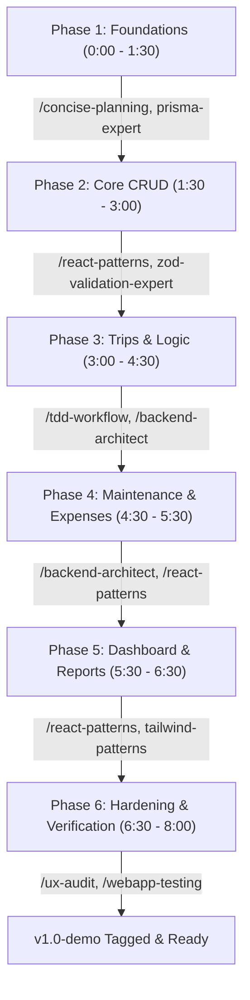

# TransitOps — Development Plan & Skill Mapping

This document outlines the available agentic skills and workflows in our system and maps them directly to the implementation phases of the **TransitOps** project defined in [Agent.md](file:///c:/Users/Ajith_Anand_R/Desktop/Nexora/Agent.md). It serves as a guide for when and how to leverage specialized agent behaviors to build, verify, and document this project efficiently within the 8-hour timebox.

---

## 1. Master List of Available Workflows & Skills

Below is a curated list of our available workflows and skills that are relevant to building the React + Express + SQLite (Prisma) stack, along with guidelines on when to invoke them.

| Workflow / Skill | Path / Command | Description | When to Use |
| :--- | :--- | :--- | :--- |
| **Concise Planning** | `/concise-planning` | Generates a clean, actionable, atomic checklist for complex tasks. | Use at the start of any new feature implementation to break down requirements. |
| **React Patterns** | `/react-patterns` | Modern React principles: Hooks, components, state management, and routing. | Use when building the React layout shell, context provider, and pages. |
| **Tailwind Patterns** | `/tailwind-patterns` | Tailwind CSS best practices, CSS-first config, container queries, layout styling. | Use when styling the sidebar, tables, status badges, and responsive containers. |
| **Backend Architect** | `/backend-architect` | scalable API design, Express routes, controllers, and services. | Use when setting up the Express server structure and API route logic. |
| **Prisma Expert** | `prisma-expert` | ORM modeling, `schema.prisma` configuration, SQLite database migration. | Use for writing database schemas and running SQLite migrations. |
| **Zod Validation** | `zod-validation-expert` | Zod schema validation rules, error handling, and type safety mapping. | Use when writing request validation middleware for write endpoints. |
| **TDD Workflow** | `/tdd-workflow` | Test-Driven Development cycles (RED -> GREEN -> REFACTOR). | Use when writing the complex trip validation state machine (business rules). |
| **Smart Git Automation** | `/smart-git-automation` | Git change detection, branch naming, commits, and pull requests. | Use throughout the day to commit features and manage team branches. |
| **UX Audit** | `/ux-audit` | Evaluates interfaces based on usability heuristics and responsive flow. | Use during Phase 6 (Hardening) to check layout on mobile/tablet viewports. |
| **UI Review** | `/ui-review` | Inspects UI code for styling consistency, color systems, and CSS rules. | Use to verify that state status colors (amber, green, gray) match across pages. |
| **Systematic Debugging** | `/systematic-debugging` | Logical step-by-step diagnostic workflow for bugs and errors. | Use immediately if you hit database constraint violations or JWT verification failures. |
| **Web App Testing** | `/webapp-testing` | Automated Playwright browser tests and integration checks. | Use to automate the verification checklist and ensure offline capability. |

---

## 2. Phase-by-Phase Build Plan & Skill Execution

Here is the step-by-step workflow mapping each development phase to its relevant agentic skills.

### Phase 1: Setup & Foundations (Hours 0:00 – 1:30)
* **Goal**: Establish repositories, initialize Express/Prisma, set up React routing shell, and build JWT authentication and RBAC middleware.
* **Skills to Use**:
  1. `/concise-planning`: Kick off by planning the folder structure and environment configuration.
  2. `prisma-expert`: Design the database models (Roles, Users, Vehicles, Drivers, etc.) in `schema.prisma` using SQLite.
  3. `/backend-architect`: Structure the Express API, `auth` router, and JWT signing utility.
  4. `/react-patterns`: Scaffold the Vite frontend, set up the React Router routes, and establish the Global Auth context.
  5. `/smart-git-automation`: Initialize the Git repository, configure branch protections, and push initial scaffolds on `main`.

### Phase 2: Core CRUD (Hours 1:30 – 3:00)
* **Goal**: Build Vehicles and Drivers CRUD endpoints (with validations) and corresponding list, detail, and edit screens in React.
* **Skills to Use**:
  1. `zod-validation-expert`: Define schema validation for creating/updating vehicles and drivers.
  2. `/backend-architect`: Write API controller handlers that interact with Prisma to store/retrieve these entities.
  3. `/react-patterns`: Construct reusable forms, list tables, and action buttons in React.
  4. `/tailwind-patterns`: Design clean responsive status badges (green = Available, amber = In Shop, gray = Off Duty).
  5. `/smart-git-automation`: Create branches `feature/vehicles` and `feature/drivers`, commit clean chunks, and merge into `main`.

### Phase 3: Trips & Dispatch Business Logic (Hours 3:00 – 4:30)
* **Goal**: Implement the core trip creation/dispatch state machine. Enforce business checks (e.g., driver license validation, vehicle weight limits) inside a DB transaction.
* **Skills to Use**:
  1. `/tdd-workflow`: Write unit tests for the core validation function `validateAndDispatchTrip` (e.g., checking weight limit assert, expired driver license assert) before implementing code.
  2. `/backend-architect`: Implement database transaction logic using Prisma `$transaction` to ensure consistent state transitions.
  3. `/react-patterns`: Build a step-by-step dispatch wizard and detail views containing action triggers (Dispatch, Complete, Cancel).
  4. `/systematic-debugging`: Debug database locks or state desynchronization issues if they arise during transaction testing.

### Phase 4: Maintenance & Fuel/Expense Logging (Hours 4:30 – 5:30)
* **Goal**: Track maintenance logs and cost transactions, and ensure that moving a vehicle into the shop automatically updates its status and excludes it from dispatch lists.
* **Skills to Use**:
  1. `/backend-architect`: Hook into vehicle status transitions upon opening and closing maintenance logs.
  2. `/react-patterns`: Design fuel and expense registry forms ensuring they tie correctly to specific vehicles and trips.
  3. `/tailwind-patterns`: Align table styling for audit logs, keeping fonts readable and margins clean.

### Phase 5: Dashboard & Visual Reports (Hours 5:30 – 6:30)
* **Goal**: Build KPI cards, fleet utilization charts, ROI calculations, and CSV export.
* **Skills to Use**:
  1. `/backend-architect`: Optimize aggregate query performance (e.g., calculating fleet utilization and vehicle-specific ROI metrics).
  2. `/react-patterns`: Wire up charts using `Recharts` and handle real-time metric updates on state changes.
  3. `/tailwind-patterns`: Create a "bento grid" layout for the dashboard summary metrics.

### Phase 6: Hardening, QA & Verification (Hours 6:30 – 8:00)
* **Goal**: Implement responsiveness, dark mode, audit checks, role-based navigation visibility, and dry-run the verification checklist.
* **Skills to Use**:
  1. `/ux-audit`: Inspect screens at different browser viewport widths to guarantee the sidebar collapses into a usable drawer and tables stack cleanly.
  2. `/ui-review`: Check consistency of status badges, typography scales, spacing tokens, and role-based permissions.
  3. `/webapp-testing`: Write or run automation checks to verify standard flows (e.g., trying to assign an In-Shop vehicle).
  4. `/smart-git-automation`: Clean up branches, ensure all changes are committed by correct authors, and tag the codebase with `v1.0-demo`.

---

## 3. Reference: How to Invoke Skills Successfully

* **To draft a structured layout/scaffold plan**:
  - Request `/concise-planning` to break a task down.
* **To check code for style rules and accessibility issues**:
  - Request `/ui-review` or `/ux-audit`.
* **To build and debug state machines or transaction blocks**:
  - Request `/tdd-workflow` to design tests, and `/systematic-debugging` to diagnose errors.
* **To handle git operations**:
  - Request `/smart-git-automation` for automated commit formatting and branch updates.
